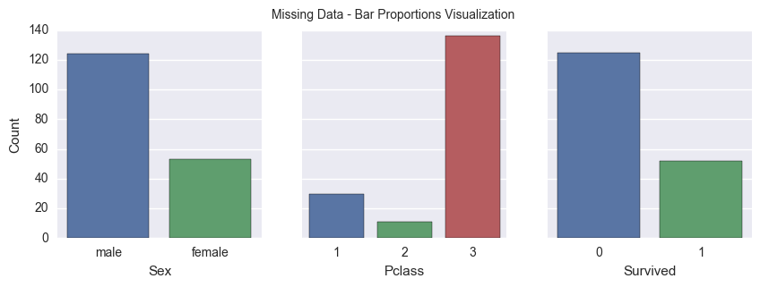
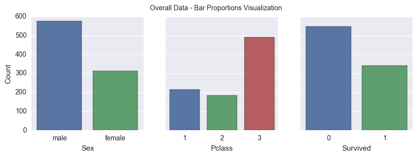
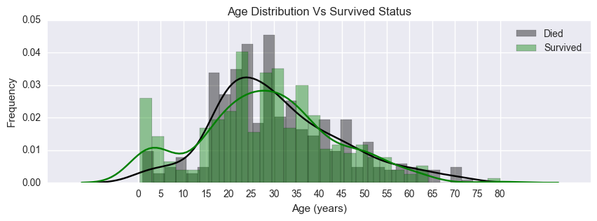
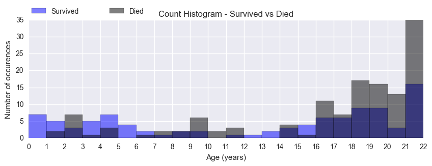
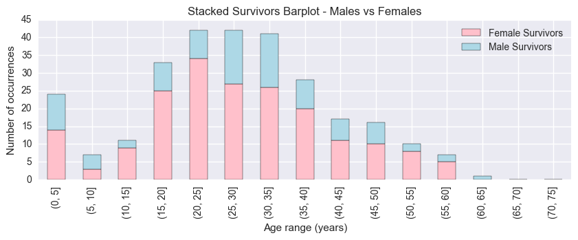
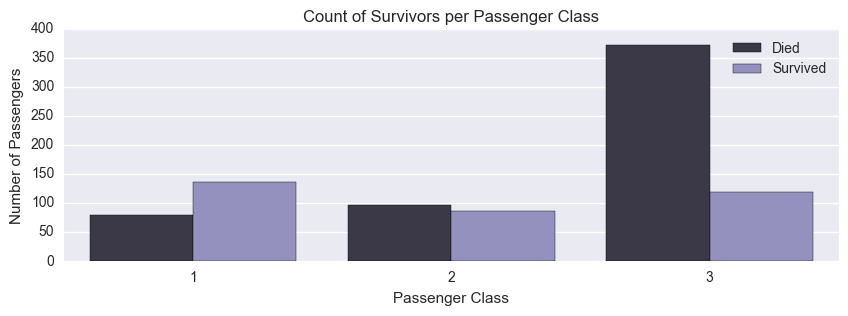
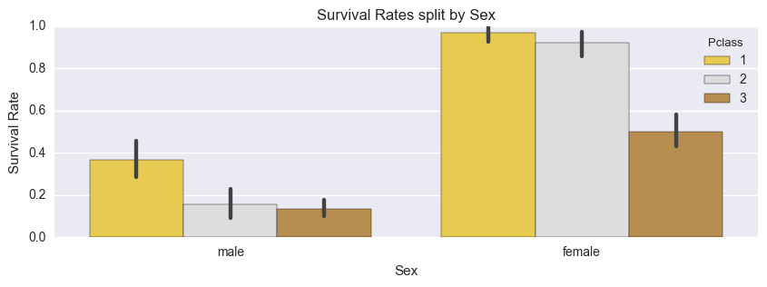

# Importing dependencies


```python
# To get float number when dividing integers
from __future__ import division
# Data Tools
import pandas as pd
import numpy as np
# Visualization Tools
from matplotlib import pyplot as plt
import seaborn as sns
# We can cast this one to print DataFrames
from IPython.core import display as ICD
# Make sure the plots displays here
%matplotlib inline
```

# Variable Descriptions
Survived        0 = No; 1 = Yes
Pclass          1 = 1st; 2 = 2nd; 3 = 3rd
Name            Name
Sex             Gender
Age             Age
SibSp           Number of Siblings/Spouses Aboard
Parch           Number of Parents/Children Aboard
Ticket          Ticket Number
Fare            Passenger Fare
Cabin           Cabin
Embarked        Port of Embarkation
                (C = Cherbourg; Q = Queenstown; S = Southampton)

SPECIAL NOTES:
Pclass is a proxy for socio-economic status (SES)
 1st ~ Upper; 2nd ~ Middle; 3rd ~ Lower

Age is in Years; Fractional if Age less than One (1)
 If the Age is Estimated, it is in the form xx.5

Sibling:  Brother, Sister, Stepbrother, or Stepsister of Passenger Aboard Titanic
Spouse:   Husband or Wife of Passenger Aboard Titanic (Mistresses and Fiances Ignored)

Parent:   Mother or Father of Passenger Aboard Titanic
Child:    Son, Daughter, Stepson, or Stepdaughter of Passenger Aboard Titanic

Other family relatives excluded from this study include cousins,
nephews/nieces, aunts/uncles, and in-laws.  Some children travelled
only with a nanny, therefore parch=0 for them.  As well, some
travelled with very close friends or neighbors in a village, however,
the definitions do not support such relations.
# Load Dataframe and Preview


```python
# Reading File
path = 'titanic-data.csv'
titanic = pd.read_csv(path)
```

## Dataframe Properties

Some statistics:


```python
titanic.describe()
```


<div>
<table border="1" class="dataframe">
  <thead>
    <tr style="text-align: right;">
      <th></th>
      <th>PassengerId</th>
      <th>Survived</th>
      <th>Pclass</th>
      <th>Age</th>
      <th>SibSp</th>
      <th>Parch</th>
      <th>Fare</th>
    </tr>
  </thead>
  <tbody>
    <tr>
      <th>count</th>
      <td>891.000000</td>
      <td>891.000000</td>
      <td>891.000000</td>
      <td>714.000000</td>
      <td>891.000000</td>
      <td>891.000000</td>
      <td>891.000000</td>
    </tr>
    <tr>
      <th>mean</th>
      <td>446.000000</td>
      <td>0.383838</td>
      <td>2.308642</td>
      <td>29.699118</td>
      <td>0.523008</td>
      <td>0.381594</td>
      <td>32.204208</td>
    </tr>
    <tr>
      <th>std</th>
      <td>257.353842</td>
      <td>0.486592</td>
      <td>0.836071</td>
      <td>14.526497</td>
      <td>1.102743</td>
      <td>0.806057</td>
      <td>49.693429</td>
    </tr>
    <tr>
      <th>min</th>
      <td>1.000000</td>
      <td>0.000000</td>
      <td>1.000000</td>
      <td>0.420000</td>
      <td>0.000000</td>
      <td>0.000000</td>
      <td>0.000000</td>
    </tr>
    <tr>
      <th>25%</th>
      <td>223.500000</td>
      <td>0.000000</td>
      <td>2.000000</td>
      <td>20.125000</td>
      <td>0.000000</td>
      <td>0.000000</td>
      <td>7.910400</td>
    </tr>
    <tr>
      <th>50%</th>
      <td>446.000000</td>
      <td>0.000000</td>
      <td>3.000000</td>
      <td>28.000000</td>
      <td>0.000000</td>
      <td>0.000000</td>
      <td>14.454200</td>
    </tr>
    <tr>
      <th>75%</th>
      <td>668.500000</td>
      <td>1.000000</td>
      <td>3.000000</td>
      <td>38.000000</td>
      <td>1.000000</td>
      <td>0.000000</td>
      <td>31.000000</td>
    </tr>
    <tr>
      <th>max</th>
      <td>891.000000</td>
      <td>1.000000</td>
      <td>3.000000</td>
      <td>80.000000</td>
      <td>8.000000</td>
      <td>6.000000</td>
      <td>512.329200</td>
    </tr>
  </tbody>
</table>
</div>


Number of observations:


```python
titanic.shape[0]
```


    891


Data Preview:


```python
titanic.head()
```


<div>
<table border="1" class="dataframe">
  <thead>
    <tr style="text-align: right;">
      <th></th>
      <th>PassengerId</th>
      <th>Survived</th>
      <th>Pclass</th>
      <th>Name</th>
      <th>Sex</th>
      <th>Age</th>
      <th>SibSp</th>
      <th>Parch</th>
      <th>Ticket</th>
      <th>Fare</th>
      <th>Cabin</th>
      <th>Embarked</th>
    </tr>
  </thead>
  <tbody>
    <tr>
      <th>0</th>
      <td>1</td>
      <td>0</td>
      <td>3</td>
      <td>Braund, Mr. Owen Harris</td>
      <td>male</td>
      <td>22.0</td>
      <td>1</td>
      <td>0</td>
      <td>A/5 21171</td>
      <td>7.2500</td>
      <td>NaN</td>
      <td>S</td>
    </tr>
    <tr>
      <th>1</th>
      <td>2</td>
      <td>1</td>
      <td>1</td>
      <td>Cumings, Mrs. John Bradley (Florence Briggs Th...</td>
      <td>female</td>
      <td>38.0</td>
      <td>1</td>
      <td>0</td>
      <td>PC 17599</td>
      <td>71.2833</td>
      <td>C85</td>
      <td>C</td>
    </tr>
    <tr>
      <th>2</th>
      <td>3</td>
      <td>1</td>
      <td>3</td>
      <td>Heikkinen, Miss. Laina</td>
      <td>female</td>
      <td>26.0</td>
      <td>0</td>
      <td>0</td>
      <td>STON/O2. 3101282</td>
      <td>7.9250</td>
      <td>NaN</td>
      <td>S</td>
    </tr>
    <tr>
      <th>3</th>
      <td>4</td>
      <td>1</td>
      <td>1</td>
      <td>Futrelle, Mrs. Jacques Heath (Lily May Peel)</td>
      <td>female</td>
      <td>35.0</td>
      <td>1</td>
      <td>0</td>
      <td>113803</td>
      <td>53.1000</td>
      <td>C123</td>
      <td>S</td>
    </tr>
    <tr>
      <th>4</th>
      <td>5</td>
      <td>0</td>
      <td>3</td>
      <td>Allen, Mr. William Henry</td>
      <td>male</td>
      <td>35.0</td>
      <td>0</td>
      <td>0</td>
      <td>373450</td>
      <td>8.0500</td>
      <td>NaN</td>
      <td>S</td>
    </tr>
  </tbody>
</table>
</div>


Data types:


```python
titanic.dtypes
```


    PassengerId      int64
    Survived         int64
    Pclass           int64
    Name            object
    Sex             object
    Age            float64
    SibSp            int64
    Parch            int64
    Ticket          object
    Fare           float64
    Cabin           object
    Embarked        object
    dtype: object


Missing Data count for each variable:


```python
titanic.isnull().sum()
```


    PassengerId      0
    Survived         0
    Pclass           0
    Name             0
    Sex              0
    Age            177
    SibSp            0
    Parch            0
    Ticket           0
    Fare             0
    Cabin          687
    Embarked         2
    dtype: int64


There's a lot of missing entries for Age and this variable will be one of the three variables investigated, so let's look into it a little deeper 

Missing Data Preview:


```python
missingAges = titanic[titanic.Age.isnull()]
missingAges.head()
```


<div>
<table border="1" class="dataframe">
  <thead>
    <tr style="text-align: right;">
      <th></th>
      <th>PassengerId</th>
      <th>Survived</th>
      <th>Pclass</th>
      <th>Name</th>
      <th>Sex</th>
      <th>Age</th>
      <th>SibSp</th>
      <th>Parch</th>
      <th>Ticket</th>
      <th>Fare</th>
      <th>Cabin</th>
      <th>Embarked</th>
    </tr>
  </thead>
  <tbody>
    <tr>
      <th>5</th>
      <td>6</td>
      <td>0</td>
      <td>3</td>
      <td>Moran, Mr. James</td>
      <td>male</td>
      <td>NaN</td>
      <td>0</td>
      <td>0</td>
      <td>330877</td>
      <td>8.4583</td>
      <td>NaN</td>
      <td>Q</td>
    </tr>
    <tr>
      <th>17</th>
      <td>18</td>
      <td>1</td>
      <td>2</td>
      <td>Williams, Mr. Charles Eugene</td>
      <td>male</td>
      <td>NaN</td>
      <td>0</td>
      <td>0</td>
      <td>244373</td>
      <td>13.0000</td>
      <td>NaN</td>
      <td>S</td>
    </tr>
    <tr>
      <th>19</th>
      <td>20</td>
      <td>1</td>
      <td>3</td>
      <td>Masselmani, Mrs. Fatima</td>
      <td>female</td>
      <td>NaN</td>
      <td>0</td>
      <td>0</td>
      <td>2649</td>
      <td>7.2250</td>
      <td>NaN</td>
      <td>C</td>
    </tr>
    <tr>
      <th>26</th>
      <td>27</td>
      <td>0</td>
      <td>3</td>
      <td>Emir, Mr. Farred Chehab</td>
      <td>male</td>
      <td>NaN</td>
      <td>0</td>
      <td>0</td>
      <td>2631</td>
      <td>7.2250</td>
      <td>NaN</td>
      <td>C</td>
    </tr>
    <tr>
      <th>28</th>
      <td>29</td>
      <td>1</td>
      <td>3</td>
      <td>O'Dwyer, Miss. Ellen "Nellie"</td>
      <td>female</td>
      <td>NaN</td>
      <td>0</td>
      <td>0</td>
      <td>330959</td>
      <td>7.8792</td>
      <td>NaN</td>
      <td>Q</td>
    </tr>
  </tbody>
</table>
</div>


There's 177 missing values of Age and that's almost 20% less data points for that variable, there's a lot of valuable information missing here.

# Titanic Passengers Information

According to http://www.titanicfacts.net/titanic-passengers.html :

**Total number of passengers onboard:**
- Titanic: 1,317
- Dataframe: 891

*~ 32.36% less data*
 
**First Class:**
- Titanic: 324
- Dataframe: 216 

*~ 33.33% less data*

**Second Class:**
- Titanic: 284
- Dataframe: 184

*~ -35.21% less data*

**Third Class:**
- Titanic: 709
- Dataframe: 491

*~ -30.75% less data*

**Children (mainly travelling in third class):**
- Titanic: 107
- Dataframe: 77

*~ 38.96% less data*

*Assuming child label is given to those with age <= 14

**Adult male:**
- Titanic: 805
- Dataframe: 395

*~ 50.93% less data*

*Assuming adult label is given to those with age >= 18

**Adult female:**
- Titanic: 402
- Dataframe: 206

*~ 49.75% less data*

*Assuming adult label is given to those with age >= 18

**There is difference in counting in different sources, but the main point is:**

Comparing the information of this dataset with the Titanic information found, we know that this is not just a sample but a limited one, as there's many missing values for some variables. Therefore, all inferences and assumptions we will try to guess might not represent the population parameters as they're based on sample statistics.

# Variables of choice:

I have decided to investigate the relationship between Survived (as as binary status) and  the variables Age, Sex and Pclas since those seems to be the most promising features to explore. In a function-like notation we'll try to better understand: *Survived(PClass,Sex,Age)*


```python
# Setting functions to get an informative Dataframe containing what I think is useful information of the missing data
def customTable(var):
    output = pd.DataFrame(var.value_counts())
    output = output.reset_index()
    output['Proportion'] = output[var.name].values/output[var.name].sum()
    output = output.rename(index=str,columns={var.name : 'Count'})
    output = output.rename(index=str,columns={'index': var.name})
    return output

def customPlot(var,axis):
    if type(axis) is not 'matplotlib.axes._subplots.AxesSubplot':
        fig, axis = plt.subplots()
    df = customTable(var)
    g = sns.barplot(x = var.name, y = 'Count', data=df,ax=axis)
    g.set(ylabel='Count')
    return g

def reusableCombo(df,title):
    ICD.display(customTable(df.Sex), customTable(df.Pclass), customTable(df.Survived))
    plt.rcParams['figure.figsize']=(10,3)
    fig, (ax1,ax2,ax3) = plt.subplots(ncols=3,sharey=True)

    sns.barplot(x = 'Sex', y='Count', data=customTable(df.Sex), ax=ax1).set(ylabel='Count')
    sns.barplot(x = 'Pclass', y='Count', data=customTable(df.Pclass), ax=ax2).set(ylabel='')
    sns.barplot(x = 'Survived', y='Count', data=customTable(df.Survived), ax=ax3).set(ylabel='')
    fig.suptitle(title)
    return None
```

# Comparing Age missing entries to Overall Data

Proportion of Passengers split by Gender, Passenger Class and Survived:


```python
print(10*'-'+' Missing Data: '+10*'-')
reusableCombo(missingAges,'Missing Data - Bar Proportions Visualization')
print(10*'-'+' Overall Data: '+10*'-')
reusableCombo(titanic,'Overall Data - Bar Proportions Visualization')
```

    ---------- Missing Data: ----------
    


<div>
<table border="1" class="dataframe">
  <thead>
    <tr style="text-align: right;">
      <th></th>
      <th>Sex</th>
      <th>Count</th>
      <th>Proportion</th>
    </tr>
  </thead>
  <tbody>
    <tr>
      <th>0</th>
      <td>male</td>
      <td>124</td>
      <td>0.700565</td>
    </tr>
    <tr>
      <th>1</th>
      <td>female</td>
      <td>53</td>
      <td>0.299435</td>
    </tr>
  </tbody>
</table>
</div>


<div>
<table border="1" class="dataframe">
  <thead>
    <tr style="text-align: right;">
      <th></th>
      <th>Pclass</th>
      <th>Count</th>
      <th>Proportion</th>
    </tr>
  </thead>
  <tbody>
    <tr>
      <th>0</th>
      <td>3</td>
      <td>136</td>
      <td>0.768362</td>
    </tr>
    <tr>
      <th>1</th>
      <td>1</td>
      <td>30</td>
      <td>0.169492</td>
    </tr>
    <tr>
      <th>2</th>
      <td>2</td>
      <td>11</td>
      <td>0.062147</td>
    </tr>
  </tbody>
</table>
</div>


<div>
<table border="1" class="dataframe">
  <thead>
    <tr style="text-align: right;">
      <th></th>
      <th>Survived</th>
      <th>Count</th>
      <th>Proportion</th>
    </tr>
  </thead>
  <tbody>
    <tr>
      <th>0</th>
      <td>0</td>
      <td>125</td>
      <td>0.706215</td>
    </tr>
    <tr>
      <th>1</th>
      <td>1</td>
      <td>52</td>
      <td>0.293785</td>
    </tr>
  </tbody>
</table>
</div>


    ---------- Overall Data: ----------
    


<div>
<table border="1" class="dataframe">
  <thead>
    <tr style="text-align: right;">
      <th></th>
      <th>Sex</th>
      <th>Count</th>
      <th>Proportion</th>
    </tr>
  </thead>
  <tbody>
    <tr>
      <th>0</th>
      <td>male</td>
      <td>577</td>
      <td>0.647587</td>
    </tr>
    <tr>
      <th>1</th>
      <td>female</td>
      <td>314</td>
      <td>0.352413</td>
    </tr>
  </tbody>
</table>
</div>


<div>
<table border="1" class="dataframe">
  <thead>
    <tr style="text-align: right;">
      <th></th>
      <th>Pclass</th>
      <th>Count</th>
      <th>Proportion</th>
    </tr>
  </thead>
  <tbody>
    <tr>
      <th>0</th>
      <td>3</td>
      <td>491</td>
      <td>0.551066</td>
    </tr>
    <tr>
      <th>1</th>
      <td>1</td>
      <td>216</td>
      <td>0.242424</td>
    </tr>
    <tr>
      <th>2</th>
      <td>2</td>
      <td>184</td>
      <td>0.206510</td>
    </tr>
  </tbody>
</table>
</div>


<div>
<table border="1" class="dataframe">
  <thead>
    <tr style="text-align: right;">
      <th></th>
      <th>Survived</th>
      <th>Count</th>
      <th>Proportion</th>
    </tr>
  </thead>
  <tbody>
    <tr>
      <th>0</th>
      <td>0</td>
      <td>549</td>
      <td>0.616162</td>
    </tr>
    <tr>
      <th>1</th>
      <td>1</td>
      <td>342</td>
      <td>0.383838</td>
    </tr>
  </tbody>
</table>
</div>








### Impressions about Missing Data Vs Titanic Dataframe Data: <br>

**Sex**: 
- ~8.18% more Male data points.<br>

**Pclass**:  
- ~30.09% less 1st class data points
- ~39.43% more 3rd class data points
- ~69,91% 2nd class data points<br>

**Survived**: 
- ~14.62% more datapoints for people that died.

# Data manipulation on Infants Age

I've noticed that the Ages for Childs under one year old are expressed in fractions, for convenience I'll replace that with 0.

Let's also restrict our data to what we'll use, producing a dataframe containing only Pclass, Survived, Age and Sex as variables.


```python
# Selecting variables to investigate

df = titanic[['Pclass','Survived','Sex','Age']].copy()
df.loc[df['Age'] < 1, 'Age'] = 0

# Separating another DF just in case I need it later to see if there's any correlation between people with family aboard and their Survival chance
# Given that a Person has a child or came aboard with a brother, husband, wife, etc. does that look like a promising feature
# to predict any group's survival rates?
# Childs with Parch or SibSp have better survival chances? 

tt = titanic[['Pclass','Survived','Sex','Age','SibSp','Parch']]
```


```python
df.head()
```


<div>
<table border="1" class="dataframe">
  <thead>
    <tr style="text-align: right;">
      <th></th>
      <th>Pclass</th>
      <th>Survived</th>
      <th>Sex</th>
      <th>Age</th>
    </tr>
  </thead>
  <tbody>
    <tr>
      <th>0</th>
      <td>3</td>
      <td>0</td>
      <td>male</td>
      <td>22.0</td>
    </tr>
    <tr>
      <th>1</th>
      <td>1</td>
      <td>1</td>
      <td>female</td>
      <td>38.0</td>
    </tr>
    <tr>
      <th>2</th>
      <td>3</td>
      <td>1</td>
      <td>female</td>
      <td>26.0</td>
    </tr>
    <tr>
      <th>3</th>
      <td>1</td>
      <td>1</td>
      <td>female</td>
      <td>35.0</td>
    </tr>
    <tr>
      <th>4</th>
      <td>3</td>
      <td>0</td>
      <td>male</td>
      <td>35.0</td>
    </tr>
  </tbody>
</table>
</div>


# Initial wondering about the data:

Let's try to guess what happens when comparing Age and Survived, does it makes sense that we express Age with discrete values?

#### What do the Age value can tell us?

For problems age might give us a good guess of how a person can perform better or worse (in average) than others as we're looking at "Age" of some kind of physical capabilities indicator (measuring how we loose those capabilities overtime), in a case scenario where people's lives depend on a person individual physical performace, expressing age with discrete values can make sense and highly correlate with an arbitrary person Survival rate.

The data being investigated here refers to a disaster that occurred in a ship, surviving doesn't follow the same metrics (correlate to the same features) as it would be in a "lost in the jungle" or "1 Vs 1 fight" situation, for instance.

To reinforce why I think Age would be better expressed another way, let's picture what may have happened to two young males (regardless of other features), is that  reasonable to assume that a 25 years old men is more likely to survived than a 35 years old man? I'd say: Probably not, this is not a matter of disputing who's surviving or not using strength.

#### What is expected in this situation?

It is common knowledge that in ship sinking situation the priority would be "Women and children first", so we will check if that applies here.

That's why I'll probably express Ages on groups, it can be a Range of ages or Categories but Age as a bunch of discrete float values just doesn't seem very promissing as a feature at the moment.


Under this environment, what I would actually expect is that Age would be more reasonably expressed another way, maybe with categories like: Infant, Children, Young and Old. Even though some of those categories may not correlate at all with Survival rates and we better drop unecessary features.

# Creating supplementary DataFrames

Splitting Died vs Survived:


```python
# Split Dataset by two by Survived status

Died, Survived = [row for _, row in df.groupby('Survived')]

# And now that we know that they've Died or Survived because they're now split,
# We can then remove the 'Survived' key
del Died['Survived'], Survived['Survived']
```

Splitting Female vs Male:


```python
# Splitting pd.DataFrame by gender
Female, Male = [row for _, row in df.groupby('Sex')]

# Deleting unecessary keys
del Female['Sex'], Male['Sex']
```

Splitting Pclasses:


```python
# Creating a Dataframe for convenient use when/if needed:
Pclass1, Pclass2, Pclass3 = [row for _, row in df.groupby('Pclass')]
Pclass1 = Pclass1.rename(index=str,columns={'Pclass':'Pclass1'})
Pclass2 = Pclass2.rename(index=str,columns={'Pclass':'Pclass2'})
Pclass3 = Pclass3.rename(index=str,columns={'Pclass':'Pclass3'})
Pclass2.loc[Pclass2['Pclass2'].notnull(), 'Pclass2'] = 1
Pclass3.loc[Pclass3['Pclass3'].notnull(), 'Pclass3'] = 1
```

# Age Investigation

To accomplish this task I decided to drop NaN values, I belive this is a good way to start when there's no prior knowledge of the data, therefore we're analyzing the dataframe partially for this category.

Other strategies can be adopted, such as:
- Using an algorithim to determine which values to replace the NaNs to achieve better predictions considering; (Sex,Pclass,Survived);
- Replacing NaNs with the average Age of the dataset or for each group;
- etc.

The better strategy is the one that will genuinely increase the accuracy of our prediction model, making our model more realistic instead of more "overfitting"


```python
sns.distplot(titanic.loc[(df['Survived']==0) & (~df['Age'].isnull()),'Age'],color='black', bins=30)
sns.distplot(titanic.loc[(df['Survived']==1) & (~df['Age'].isnull()),'Age'],color='green', bins=30)
plt.xticks(np.arange(0, max(df.Age)+1, 5))
plt.title('Age Distribution Vs Survived Status')
plt.ylabel('Frequency')
plt.xlabel('Age (years)')
plt.legend(['Died', 'Survived']);
```





We can see that in this distribution of grouped ages that the number of Survivors seems only to be greater on ~[0,16[ and for some people between 45-50.

The first group seems reasonable since it's a priority group, the second one doesn't make much sense (maybe is a cluster of females or 1st class passengers), let's check it out:

- Further look at 45-50 data:


```python
ICD.display('Lived:',df[['Pclass','Sex']].loc[(df.Age >= 47.5) & (df.Age < 50) & (df.Survived == 1)],'Died:',
      df[['Pclass','Sex']].loc[(df.Age >= 47.5) & (df.Age < 50) & (df.Survived == 0)])
```


    'Lived:'


<div>
<table border="1" class="dataframe">
  <thead>
    <tr style="text-align: right;">
      <th></th>
      <th>Pclass</th>
      <th>Sex</th>
    </tr>
  </thead>
  <tbody>
    <tr>
      <th>52</th>
      <td>1</td>
      <td>female</td>
    </tr>
    <tr>
      <th>453</th>
      <td>1</td>
      <td>male</td>
    </tr>
    <tr>
      <th>460</th>
      <td>1</td>
      <td>male</td>
    </tr>
    <tr>
      <th>556</th>
      <td>1</td>
      <td>female</td>
    </tr>
    <tr>
      <th>599</th>
      <td>1</td>
      <td>male</td>
    </tr>
    <tr>
      <th>645</th>
      <td>1</td>
      <td>male</td>
    </tr>
    <tr>
      <th>712</th>
      <td>1</td>
      <td>male</td>
    </tr>
    <tr>
      <th>754</th>
      <td>2</td>
      <td>female</td>
    </tr>
    <tr>
      <th>796</th>
      <td>1</td>
      <td>female</td>
    </tr>
    <tr>
      <th>862</th>
      <td>1</td>
      <td>female</td>
    </tr>
  </tbody>
</table>
</div>


    'Died:'


<div>
<table border="1" class="dataframe">
  <thead>
    <tr style="text-align: right;">
      <th></th>
      <th>Pclass</th>
      <th>Sex</th>
    </tr>
  </thead>
  <tbody>
    <tr>
      <th>463</th>
      <td>2</td>
      <td>male</td>
    </tr>
    <tr>
      <th>597</th>
      <td>3</td>
      <td>male</td>
    </tr>
    <tr>
      <th>698</th>
      <td>1</td>
      <td>male</td>
    </tr>
    <tr>
      <th>736</th>
      <td>3</td>
      <td>female</td>
    </tr>
    <tr>
      <th>771</th>
      <td>3</td>
      <td>male</td>
    </tr>
  </tbody>
</table>
</div>


It appears to be a cluster of fortunate properties on those survivors, almost all of them are in 1st class, the only outlier fits another priority group (female).

There's also unfortunate properties on the dead people data, people on priority groups are not "double prioritized", the 1st class passenger is a male and the female is a 3rd class passenger.

- "Children":


```python
# Count of Survived vs Died by Age
plt.xticks(np.arange(0, max(df.Age)+1, 1))
plt.xlabel('Age (years)')
plt.ylabel('Number of occurences')
plt.title('Count Histogram - Survived vs Died')
plt.yticks(np.arange(0,500, 5))
bins = 22
crange = [0,22]
# Dropping NaN ages
plt.hist(Survived.Age.dropna(),bins, range=crange, facecolor='blue', align='mid',alpha=0.5,label='Survived')
plt.hist(Died.dropna().Age,bins, range=crange, facecolor='black', align='mid',alpha=0.5,label='Died')
plt.legend(bbox_to_anchor=(0., 1.02, .3, 0.), loc=3,
           ncol=2, mode="expand", borderaxespad=0.)
```


    <matplotlib.legend.Legend at 0x69ee390>




There's very few data points here, it's hard to inference from this data representative meaningful information as it is.

The estimate of Children being defined as under 17 doesn't seem accurate from this perspective, the proportion of dead children seems to be more consistent after 6 years old. 

```python
df.loc[(df.Age >= 12) & (df.Age <= 16)].sort_values('Sex')
```


<div>
<table border="1" class="dataframe">
  <thead>
    <tr style="text-align: right;">
      <th></th>
      <th>Pclass</th>
      <th>Survived</th>
      <th>Sex</th>
      <th>Age</th>
    </tr>
  </thead>
  <tbody>
    <tr>
      <th>9</th>
      <td>2</td>
      <td>1</td>
      <td>female</td>
      <td>14.0</td>
    </tr>
    <tr>
      <th>830</th>
      <td>3</td>
      <td>1</td>
      <td>female</td>
      <td>15.0</td>
    </tr>
    <tr>
      <th>780</th>
      <td>3</td>
      <td>1</td>
      <td>female</td>
      <td>13.0</td>
    </tr>
    <tr>
      <th>689</th>
      <td>1</td>
      <td>1</td>
      <td>female</td>
      <td>15.0</td>
    </tr>
    <tr>
      <th>504</th>
      <td>1</td>
      <td>1</td>
      <td>female</td>
      <td>16.0</td>
    </tr>
    <tr>
      <th>446</th>
      <td>2</td>
      <td>1</td>
      <td>female</td>
      <td>13.0</td>
    </tr>
    <tr>
      <th>435</th>
      <td>1</td>
      <td>1</td>
      <td>female</td>
      <td>14.0</td>
    </tr>
    <tr>
      <th>853</th>
      <td>1</td>
      <td>1</td>
      <td>female</td>
      <td>16.0</td>
    </tr>
    <tr>
      <th>329</th>
      <td>1</td>
      <td>1</td>
      <td>female</td>
      <td>16.0</td>
    </tr>
    <tr>
      <th>208</th>
      <td>3</td>
      <td>1</td>
      <td>female</td>
      <td>16.0</td>
    </tr>
    <tr>
      <th>875</th>
      <td>3</td>
      <td>1</td>
      <td>female</td>
      <td>15.0</td>
    </tr>
    <tr>
      <th>14</th>
      <td>3</td>
      <td>0</td>
      <td>female</td>
      <td>14.0</td>
    </tr>
    <tr>
      <th>22</th>
      <td>3</td>
      <td>1</td>
      <td>female</td>
      <td>15.0</td>
    </tr>
    <tr>
      <th>111</th>
      <td>3</td>
      <td>0</td>
      <td>female</td>
      <td>14.5</td>
    </tr>
    <tr>
      <th>71</th>
      <td>3</td>
      <td>0</td>
      <td>female</td>
      <td>16.0</td>
    </tr>
    <tr>
      <th>39</th>
      <td>3</td>
      <td>1</td>
      <td>female</td>
      <td>14.0</td>
    </tr>
    <tr>
      <th>156</th>
      <td>3</td>
      <td>1</td>
      <td>female</td>
      <td>16.0</td>
    </tr>
    <tr>
      <th>220</th>
      <td>3</td>
      <td>1</td>
      <td>male</td>
      <td>16.0</td>
    </tr>
    <tr>
      <th>841</th>
      <td>2</td>
      <td>0</td>
      <td>male</td>
      <td>16.0</td>
    </tr>
    <tr>
      <th>791</th>
      <td>2</td>
      <td>0</td>
      <td>male</td>
      <td>16.0</td>
    </tr>
    <tr>
      <th>764</th>
      <td>3</td>
      <td>0</td>
      <td>male</td>
      <td>16.0</td>
    </tr>
    <tr>
      <th>746</th>
      <td>3</td>
      <td>0</td>
      <td>male</td>
      <td>16.0</td>
    </tr>
    <tr>
      <th>683</th>
      <td>3</td>
      <td>0</td>
      <td>male</td>
      <td>14.0</td>
    </tr>
    <tr>
      <th>574</th>
      <td>3</td>
      <td>0</td>
      <td>male</td>
      <td>16.0</td>
    </tr>
    <tr>
      <th>86</th>
      <td>3</td>
      <td>0</td>
      <td>male</td>
      <td>16.0</td>
    </tr>
    <tr>
      <th>352</th>
      <td>3</td>
      <td>0</td>
      <td>male</td>
      <td>15.0</td>
    </tr>
    <tr>
      <th>125</th>
      <td>3</td>
      <td>1</td>
      <td>male</td>
      <td>12.0</td>
    </tr>
    <tr>
      <th>138</th>
      <td>3</td>
      <td>0</td>
      <td>male</td>
      <td>16.0</td>
    </tr>
    <tr>
      <th>282</th>
      <td>3</td>
      <td>0</td>
      <td>male</td>
      <td>16.0</td>
    </tr>
    <tr>
      <th>266</th>
      <td>3</td>
      <td>0</td>
      <td>male</td>
      <td>16.0</td>
    </tr>
    <tr>
      <th>686</th>
      <td>3</td>
      <td>0</td>
      <td>male</td>
      <td>14.0</td>
    </tr>
    <tr>
      <th>333</th>
      <td>3</td>
      <td>0</td>
      <td>male</td>
      <td>16.0</td>
    </tr>
  </tbody>
</table>
</div>


Indeed this doesn't seem to confirm the first impression of a [0,16[ as a good age range to define a Child.

We can see that survivors were mostly females with more than 12 years old (as far as this data is telling us), it seems like the range [0,12] seems more reasonable. 

Let's check again the new range:


```python
df.ix[(df.Age > 10) & (df.Age < 14)]
```


<div>
<table border="1" class="dataframe">
  <thead>
    <tr style="text-align: right;">
      <th></th>
      <th>Pclass</th>
      <th>Survived</th>
      <th>Sex</th>
      <th>Age</th>
    </tr>
  </thead>
  <tbody>
    <tr>
      <th>59</th>
      <td>3</td>
      <td>0</td>
      <td>male</td>
      <td>11.0</td>
    </tr>
    <tr>
      <th>125</th>
      <td>3</td>
      <td>1</td>
      <td>male</td>
      <td>12.0</td>
    </tr>
    <tr>
      <th>446</th>
      <td>2</td>
      <td>1</td>
      <td>female</td>
      <td>13.0</td>
    </tr>
    <tr>
      <th>542</th>
      <td>3</td>
      <td>0</td>
      <td>female</td>
      <td>11.0</td>
    </tr>
    <tr>
      <th>731</th>
      <td>3</td>
      <td>0</td>
      <td>male</td>
      <td>11.0</td>
    </tr>
    <tr>
      <th>780</th>
      <td>3</td>
      <td>1</td>
      <td>female</td>
      <td>13.0</td>
    </tr>
    <tr>
      <th>802</th>
      <td>1</td>
      <td>1</td>
      <td>male</td>
      <td>11.0</td>
    </tr>
  </tbody>
</table>
</div>


There's only Dead entries for 3rd Pclass passengers and they've all died, so I'm not sure if 12 years old is reasonable either.

Let's check the ages from [10-12[:


```python
df.ix[(df.Age >= 10) & (df.Age < 12)].sort_values('Sex')
```


<div>
<table border="1" class="dataframe">
  <thead>
    <tr style="text-align: right;">
      <th></th>
      <th>Pclass</th>
      <th>Survived</th>
      <th>Sex</th>
      <th>Age</th>
    </tr>
  </thead>
  <tbody>
    <tr>
      <th>419</th>
      <td>3</td>
      <td>0</td>
      <td>female</td>
      <td>10.0</td>
    </tr>
    <tr>
      <th>542</th>
      <td>3</td>
      <td>0</td>
      <td>female</td>
      <td>11.0</td>
    </tr>
    <tr>
      <th>59</th>
      <td>3</td>
      <td>0</td>
      <td>male</td>
      <td>11.0</td>
    </tr>
    <tr>
      <th>731</th>
      <td>3</td>
      <td>0</td>
      <td>male</td>
      <td>11.0</td>
    </tr>
    <tr>
      <th>802</th>
      <td>1</td>
      <td>1</td>
      <td>male</td>
      <td>11.0</td>
    </tr>
    <tr>
      <th>819</th>
      <td>3</td>
      <td>0</td>
      <td>male</td>
      <td>10.0</td>
    </tr>
  </tbody>
</table>
</div>


One thing is becoming more clear, it seems like the Pclass played a big role on children survival chances. We can see that most deaths come from 3rd class children passengers.

It also appears that being a Female correlates to survival rates for teenagers as we can see that the marjority of died entries are from young males.

#### Feature creation choice:

- I'll be defining 'Children' as [0-6] people, that seems a more secure choice.
- The dummy attribute 'Young' will be used to discriminate those data points between ]6-18]

# Creating a supplementary Dummy Dataframe

This Dataframe can later be used to improve a prediction model, we can test many combinations of features to see which one give us a better accuracy but also the wrangling makes sense (it's not just conventionally wrangled to overfit).


```python
Dummy = pd.concat([Pclass1,Pclass2,Pclass3])
Dummy[['Pclass1','Pclass2','Pclass3']] = Dummy[['Pclass1','Pclass2','Pclass3']].fillna(value=0)
Dummy['Sex']=Dummy['Sex'].replace(to_replace='female',value=1)
Dummy['Sex']=Dummy['Sex'].replace('male',0)
Dummy = Dummy.rename(index=str,columns={'Sex': 'Is_Female'})
Dummy = Dummy.sort_values('Age',ascending=1)
Dummy = Dummy.reset_index(drop=True)
Dummy.loc[Dummy.Age <= 6, 'Is_Child'] = 1
Dummy.loc[(Dummy.Age > 6) & (Dummy.Age <= 17), 'Is_Young'] = 1
Dummy[['Is_Female','Is_Child','Is_Young']] = Dummy[['Is_Female','Is_Child','Is_Young']].fillna(value=0)
del Dummy['Age']
Dummy = Dummy.astype(np.int64)
```


```python
Dummy.sample(n=10)
```


<div>
<table border="1" class="dataframe">
  <thead>
    <tr style="text-align: right;">
      <th></th>
      <th>Pclass1</th>
      <th>Pclass2</th>
      <th>Pclass3</th>
      <th>Is_Female</th>
      <th>Survived</th>
      <th>Is_Child</th>
      <th>Is_Young</th>
    </tr>
  </thead>
  <tbody>
    <tr>
      <th>194</th>
      <td>0</td>
      <td>0</td>
      <td>1</td>
      <td>0</td>
      <td>0</td>
      <td>0</td>
      <td>0</td>
    </tr>
    <tr>
      <th>129</th>
      <td>0</td>
      <td>0</td>
      <td>1</td>
      <td>1</td>
      <td>1</td>
      <td>0</td>
      <td>0</td>
    </tr>
    <tr>
      <th>353</th>
      <td>0</td>
      <td>1</td>
      <td>0</td>
      <td>1</td>
      <td>1</td>
      <td>0</td>
      <td>0</td>
    </tr>
    <tr>
      <th>175</th>
      <td>0</td>
      <td>0</td>
      <td>1</td>
      <td>0</td>
      <td>1</td>
      <td>0</td>
      <td>0</td>
    </tr>
    <tr>
      <th>629</th>
      <td>0</td>
      <td>0</td>
      <td>1</td>
      <td>1</td>
      <td>0</td>
      <td>0</td>
      <td>0</td>
    </tr>
    <tr>
      <th>443</th>
      <td>0</td>
      <td>1</td>
      <td>0</td>
      <td>0</td>
      <td>1</td>
      <td>0</td>
      <td>0</td>
    </tr>
    <tr>
      <th>630</th>
      <td>1</td>
      <td>0</td>
      <td>0</td>
      <td>1</td>
      <td>1</td>
      <td>0</td>
      <td>0</td>
    </tr>
    <tr>
      <th>405</th>
      <td>1</td>
      <td>0</td>
      <td>0</td>
      <td>0</td>
      <td>0</td>
      <td>0</td>
      <td>0</td>
    </tr>
    <tr>
      <th>188</th>
      <td>0</td>
      <td>0</td>
      <td>1</td>
      <td>0</td>
      <td>0</td>
      <td>0</td>
      <td>0</td>
    </tr>
    <tr>
      <th>299</th>
      <td>0</td>
      <td>0</td>
      <td>1</td>
      <td>0</td>
      <td>0</td>
      <td>0</td>
      <td>0</td>
    </tr>
  </tbody>
</table>
</div>


```python
# Just making sure we're not missing data points
Dummy.shape
```


    (891, 7)


# Sex Investigation


```python
# Generating a DataFrame containing Male Survivors and Female Survivors as Keys.

g = pd.DataFrame({'Male Survivors': Male.groupby(pd.cut(Male["Age"], np.arange(0, Male["Age"].max(), 5))).sum()['Survived'],
                     'Female Survivors': Female.groupby(pd.cut(Female["Age"], np.arange(0, Female["Age"].max(), 5))).sum()['Survived']})

# Plotting a stacked bar to visualize

g.plot.bar(stacked=True,color=['pink','lightblue'])
plt.xlabel('Age range (years)')
plt.ylabel('Number of occurrences')
plt.title('Stacked Survivors Barplot - Males vs Females')
```


    <matplotlib.text.Text at 0xb7189b0>





```python
Female.loc[Female.Survived == 0].describe()
```


<div>
<table border="1" class="dataframe">
  <thead>
    <tr style="text-align: right;">
      <th></th>
      <th>Pclass</th>
      <th>Survived</th>
      <th>Age</th>
    </tr>
  </thead>
  <tbody>
    <tr>
      <th>count</th>
      <td>81.000000</td>
      <td>81.0</td>
      <td>64.000000</td>
    </tr>
    <tr>
      <th>mean</th>
      <td>2.851852</td>
      <td>0.0</td>
      <td>25.046875</td>
    </tr>
    <tr>
      <th>std</th>
      <td>0.450309</td>
      <td>0.0</td>
      <td>13.618591</td>
    </tr>
    <tr>
      <th>min</th>
      <td>1.000000</td>
      <td>0.0</td>
      <td>2.000000</td>
    </tr>
    <tr>
      <th>25%</th>
      <td>3.000000</td>
      <td>0.0</td>
      <td>16.750000</td>
    </tr>
    <tr>
      <th>50%</th>
      <td>3.000000</td>
      <td>0.0</td>
      <td>24.500000</td>
    </tr>
    <tr>
      <th>75%</th>
      <td>3.000000</td>
      <td>0.0</td>
      <td>33.250000</td>
    </tr>
    <tr>
      <th>max</th>
      <td>3.000000</td>
      <td>0.0</td>
      <td>57.000000</td>
    </tr>
  </tbody>
</table>
</div>


It indeed seems almost clear that Women had better survival chances.

For Children though, that difference doesn't seem clear and that makes some sense. If it's up to someone to put a Child on a rescue boat, it doesn't seem very reasonable that the rescue request would be denied because of the children gender.

We've already discussed about gender impact on Young people survived rates and the range [10,15[ visually show us that this conjecture is reasonable.

# Pclass Investigation

Creating a Dataframe with Pclass information to visualize in a tabular form:


```python
# Visualize a DataFrame containing how many people survied in each Passenger class.
cut = pd.DataFrame(df.Pclass.value_counts())
# Get number of entry points for each Pclass as DF, index = [1,2,3], columns= ['Plass']
cut = pd.DataFrame(df.Pclass.value_counts())
# Create a new column Survived, containing 
cut['Survived'] = df.groupby('Pclass')['Survived'].sum()
cut['Proportion'] = cut[df.Survived.name].values/cut[df.Pclass.name]
cut = cut.rename(index=str,columns={'Pclass': 'Count'})
cut.index.names = ['Pclass']
cut = cut.sort_index(ascending=True)
cut = cut.reset_index()
cut
```


<div>
<table border="1" class="dataframe">
  <thead>
    <tr style="text-align: right;">
      <th></th>
      <th>Pclass</th>
      <th>Count</th>
      <th>Survived</th>
      <th>Proportion</th>
    </tr>
  </thead>
  <tbody>
    <tr>
      <th>0</th>
      <td>1</td>
      <td>216</td>
      <td>136</td>
      <td>0.629630</td>
    </tr>
    <tr>
      <th>1</th>
      <td>2</td>
      <td>184</td>
      <td>87</td>
      <td>0.472826</td>
    </tr>
    <tr>
      <th>2</th>
      <td>3</td>
      <td>491</td>
      <td>119</td>
      <td>0.242363</td>
    </tr>
  </tbody>
</table>
</div>


#### Approximates proportions of survivors per Passenger Class:
- 1st class: ~65% 
- 2nd class: ~48%
- 3rd class: ~24% 


```python
# Setting a visualization for that information, to give a better grasp
clrs= ['#3a354b','#8e89c5']
g = sns.countplot(x='Pclass',hue='Survived',data=df,palette=clrs)
# Count of Survived vs Died by Age
g.set(xlabel='Passenger Class', ylabel='Number of Passengers')
plt.title('Count of Survivors per Passenger Class')
g.legend(['Died','Survived'])
```


    <matplotlib.legend.Legend at 0x9c24780>





Looking at the proportion of survivors in each Passanger Class split by gender.


```python
df[['Survived','Pclass','Sex']].groupby(('Pclass','Sex')).sum() / df[['Survived','Pclass','Sex']].groupby(('Pclass','Sex')).count()
```


<div>
<table border="1" class="dataframe">
  <thead>
    <tr style="text-align: right;">
      <th></th>
      <th></th>
      <th>Survived</th>
    </tr>
    <tr>
      <th>Pclass</th>
      <th>Sex</th>
      <th></th>
    </tr>
  </thead>
  <tbody>
    <tr>
      <th rowspan="2" valign="top">1</th>
      <th>female</th>
      <td>0.968085</td>
    </tr>
    <tr>
      <th>male</th>
      <td>0.368852</td>
    </tr>
    <tr>
      <th rowspan="2" valign="top">2</th>
      <th>female</th>
      <td>0.921053</td>
    </tr>
    <tr>
      <th>male</th>
      <td>0.157407</td>
    </tr>
    <tr>
      <th rowspan="2" valign="top">3</th>
      <th>female</th>
      <td>0.500000</td>
    </tr>
    <tr>
      <th>male</th>
      <td>0.135447</td>
    </tr>
  </tbody>
</table>
</div>


The impression it give us is that the Passanger class meaningfully correlates with a passenger survival chance, that's supported by the fact that 1st class males displays better survival rates.

```python
# Visualizing the above information
clrs = ["#ffd938", "#dddddd", "#c9903f"]
g = sns.barplot(x="Sex", y="Survived", hue="Pclass", data=df,palette=clrs)
g.set(ylabel='Survival Rate')
plt.title('Survival Rates split by Sex')
```


    <matplotlib.text.Text at 0xb742908>





- Survival rates for women in the 1st and 2nd class are very high, there's a major rate drop for 3rd class women though. Threfore the strong correlation factor seems significantly different for those women

- 2nd and 3rd Class males displays roughly the same survival Proportions, Pclass appears to correlate significantlly more for Male Survivors.

# Conclusion

We've confirmed that the priority passengers were Women and Children and also develop a better grasp of the reservations of this rule. The first class meaningfully increased the chances of survival especially for males, the majority of the children who died were 3rd class passengers, also 3rd class women passengers were partially prioritized over other passengers as we've seen their survival rates are significantlly lower when compared to those women on 2nd and 1st class.

There are many limitations on this analysis and I'm sure much more can be done to improve one's understanding, we have not conducted any cluster analysis therefore some properties that we assumed True might have deceived us due the presence of similar data points possibily present in this data or in any segment used to determine features values.

# *Extra: Prediction attempt

### I barely know what I am doing here but here's it anyway:


```python
from sklearn.naive_bayes import GaussianNB
```


```python
def predict(features,labels):
    classifier = GaussianNB()
    return classifier.fit(features,labels)
```


```python
from sklearn import svm
```


```python
def pred(features,labels):
    classifier = svm.SVC(kernel='rbf')
    return classifier.fit(features,labels)
```

I'll chose to **drop entries with age missing values** and see how it goes.

#### Classifier 1


```python
df_test = df.replace(to_replace=['male','female'],value=[0,1]).dropna()
```


```python
df_test.head()
```


<div>
<table border="1" class="dataframe">
  <thead>
    <tr style="text-align: right;">
      <th></th>
      <th>Pclass</th>
      <th>Survived</th>
      <th>Sex</th>
      <th>Age</th>
    </tr>
  </thead>
  <tbody>
    <tr>
      <th>0</th>
      <td>3</td>
      <td>0</td>
      <td>0</td>
      <td>22.0</td>
    </tr>
    <tr>
      <th>1</th>
      <td>1</td>
      <td>1</td>
      <td>1</td>
      <td>38.0</td>
    </tr>
    <tr>
      <th>2</th>
      <td>3</td>
      <td>1</td>
      <td>1</td>
      <td>26.0</td>
    </tr>
    <tr>
      <th>3</th>
      <td>1</td>
      <td>1</td>
      <td>1</td>
      <td>35.0</td>
    </tr>
    <tr>
      <th>4</th>
      <td>3</td>
      <td>0</td>
      <td>0</td>
      <td>35.0</td>
    </tr>
  </tbody>
</table>
</div>


#### Classifier 2


```python
Dummy2 = Dummy.drop(df.loc[df.Age.isnull()].index)
```


```python
Dummy2.head()
```


<div>
<table border="1" class="dataframe">
  <thead>
    <tr style="text-align: right;">
      <th></th>
      <th>Pclass1</th>
      <th>Pclass2</th>
      <th>Pclass3</th>
      <th>Is_Female</th>
      <th>Survived</th>
      <th>Is_Child</th>
      <th>Is_Young</th>
    </tr>
  </thead>
  <tbody>
    <tr>
      <th>0</th>
      <td>0</td>
      <td>0</td>
      <td>1</td>
      <td>1</td>
      <td>1</td>
      <td>1</td>
      <td>0</td>
    </tr>
    <tr>
      <th>1</th>
      <td>0</td>
      <td>1</td>
      <td>0</td>
      <td>0</td>
      <td>1</td>
      <td>1</td>
      <td>0</td>
    </tr>
    <tr>
      <th>2</th>
      <td>0</td>
      <td>1</td>
      <td>0</td>
      <td>0</td>
      <td>1</td>
      <td>1</td>
      <td>0</td>
    </tr>
    <tr>
      <th>3</th>
      <td>0</td>
      <td>1</td>
      <td>0</td>
      <td>0</td>
      <td>1</td>
      <td>1</td>
      <td>0</td>
    </tr>
    <tr>
      <th>4</th>
      <td>0</td>
      <td>0</td>
      <td>1</td>
      <td>0</td>
      <td>1</td>
      <td>1</td>
      <td>0</td>
    </tr>
  </tbody>
</table>
</div>


#### Splitting into two DFs, one with 90% of the entries and the other with 10% (randomly picked)


```python
def dataframes_for_modeling(df):
    n = 0.90 # 90% of the dataframe for training
    df_sample = df.sample(n=int(round(df.shape[0]*n)))
    labels = df_sample['Survived']
    leftovers_labels = df.drop(df_sample.index)['Survived']
    leftovers = df.drop('Survived',axis=1).drop(df_sample.index)
    df_sample = df_sample.drop('Survived',axis=1)
    return (df_sample,labels,leftovers,leftovers_labels)
```

#### Function for verifying minimum and maximum accuracy after trying "n" combinations with random 90% of the total datapoints.


```python
def accuracy_range_after_n_tests(df,n):
    minimum, maximum = (1,0)
    for i in range(0,n):
        a, b, c, d = dataframes_for_modeling(df)
        clfx = predict(a,b)
        if clfx.score(c,d) > maximum:
            maximum = clfx.score(c,d)
        if clfx.score(c,d) < minimum:
            minimum = clfx.score(c,d)
    return minimum,maximum
```


```python
accuracy_range_after_n_tests(df_test,1000)
```


    (0.61971830985915488, 0.91549295774647887)


```python
accuracy_range_after_n_tests(Dummy2,1000)
```


    (0.59154929577464788, 0.90140845070422537)


```python
def accuracy_range_after_n_tests_svm(df,n):
    ai = []
    for i in range(0,100):
        a, b, c, d = dataframes_for_modeling(df_test)
        clfx = pred(a,b)
        ai += [clfx.score(c,d)]
    return(pd.Series(ai).describe())
```


```python
accuracy_range_after_n_tests_svm(df_test,100)
```


    count    100.000000
    mean       0.798310
    std        0.046082
    min        0.690141
    25%        0.760563
    50%        0.802817
    75%        0.830986
    max        0.915493
    dtype: float64


```python
accuracy_range_after_n_tests_svm(Dummy2,100)
```


    count    100.000000
    mean       0.792676
    std        0.047334
    min        0.633803
    25%        0.760563
    50%        0.788732
    75%        0.816901
    max        0.901408
    dtype: float64


**After a couple attempts predictions accuracy seems to be around 53%-96%**
